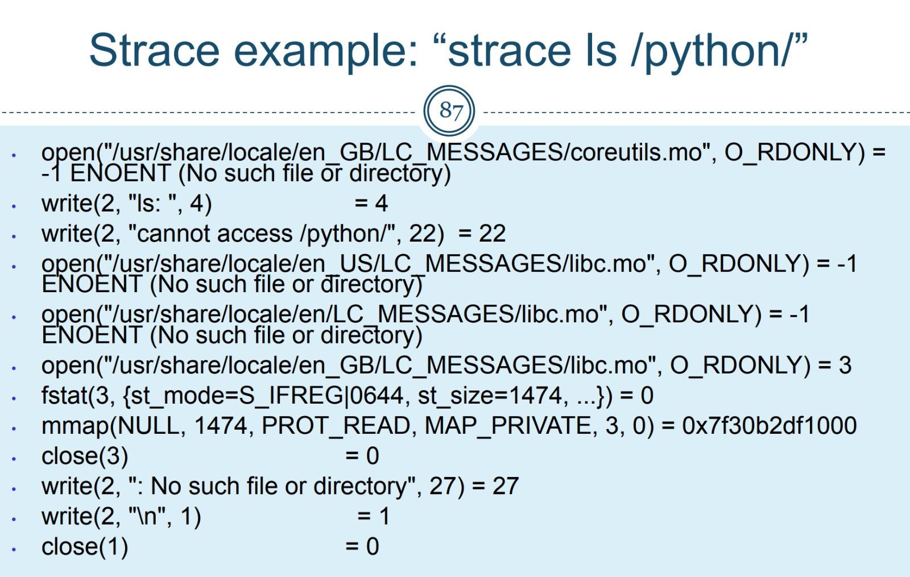
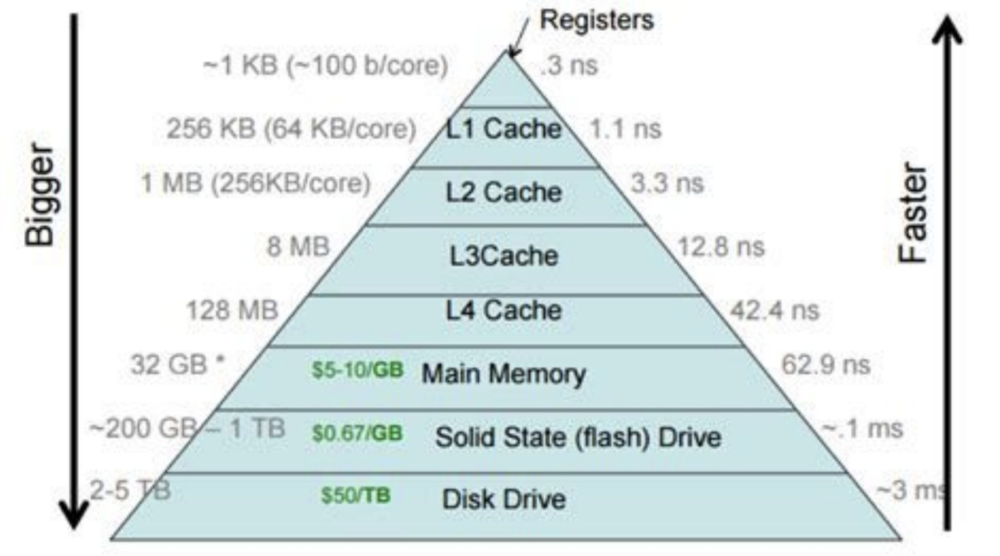
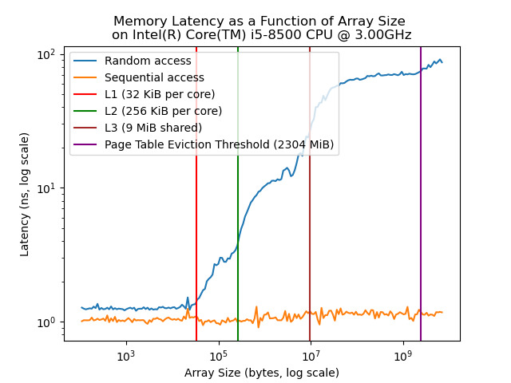

# Project 1 - Memory Latency

## Assignment 1: Understanding WhatIDo - System Call Tracing with strace



### Background
This part of the assignment aims to help us become familiar with the `strace` command. `strace` is a Linux command that traces system calls and signals of a program. It is an important tool to debug programs.

### Instructions
1. Download `WhatIDo` / Whatever other program into an empty folder.
2. Run the program using `strace`.
3. Follow the `strace` output.

### Findings
The `WhatIDo` program follows these specific steps:
1. **Initialization and Error Handling**:
   - Argument Check: Checks whether exactly one command-line argument has been provided.
   - Library Setup: Loads necessary libraries and configurations, preparing the environment for file operations.
2. **File Creation and Manipulation**:
   - Creates a directory named "Welcome" and three files within it: "Welcome", "To", and "OS-2024".
   - Writes specific messages into these files.
3. **Cleanup and Exit**:
   - Deletes all created files and the directory, then exits successfully.

## Assignment 2: Measuring Memory Access Latency Across Cache Levels and RAM

### Background
In this assignment, we measure memory read latency for the cache levels and RAM access in the target machine. We use a partially implemented C code designed to measure memory access times as accurately as possible.

### Memory Hierarchy
The following image shows the hierarchy of memory types and their relative speeds and sizes:



### Steps
1. **Complete the missing parts in the memory latency program**.
2. **Set-up a virtual machine (VM)**.
3. **Use the memory latency program to measure memory access latency** inside the VM.
4. **Plot the results in a graph**.
5. **Include the cache level sizes** in your graph.
6. **Explain the results** in this README file.

### The Memory Latency Program
The program measures the average memory access latency of different memory levels by:
- Allocating an array with the desired memory size and accessing it.
- Measuring access latency for random and sequential access patterns.

### The Memory Latency Program
The program measures the average memory access latency of different memory levels by:
- Allocating an array with the desired memory size and accessing it.
- Measuring access latency for random and sequential access patterns.

### Compilation
To compile the program, use the following command:
```sh
g++ -std=c++11 -O3 -Wall memory_latency.cpp measure.cpp -o memory_latency
```

### Running the Program
```sh
./memory_latency <max_size> <factor> <repeat>
```
- `max_size`: Maximum size of the memory array in bytes.
- `factor`: Growth factor for memory sizes.
- `repeat`: Number of times to repeat each measurement.

### Example
```sh
./memory_latency 800 1.5 200
```

### Results


The program outputs the size of the allocated array and the average latency measurements for random and sequential accesses.

### Graph and Analysis
Include a graph with the results, showing memory size on the x-axis and latency on the y-axis. Use logarithmic scales if necessary.

#### Explanation of the Results
The graph illustrates the latency as a function of array size for two test scenarios: sequential and random access.

- **Random Access Latency**:
  - Low latency for data fitting within the L1 cache.
  - Gradual increase as the array size exceeds L1 and L2 cache capacities.
  - Significant increase in latency when accessing RAM.

- **Sequential Access Latency**:
  - Benefits from cache line efficiency and hardware prefetching.
  - Lower latency compared to random access for larger arrays.

### Bonus: Page Table Eviction Threshold
Estimate the page table eviction threshold and add it to the graph. Explain the behavior observed when the array size exceeds the L3 cache size.


### Files
- `memory_latency.cpp`: Main program source file.
- `README.md`: This file containing the assignment description and explanations.
- `Makefile`: For compiling the program.
- `results.png`: Graphical representation of the results.
- `lscpu.png`: Screenshot of the `lscpu` command output.
- `page_size.png`: Screenshot of the `getconf PAGE_SIZE` command output.
- `images`: Images to present in this README
