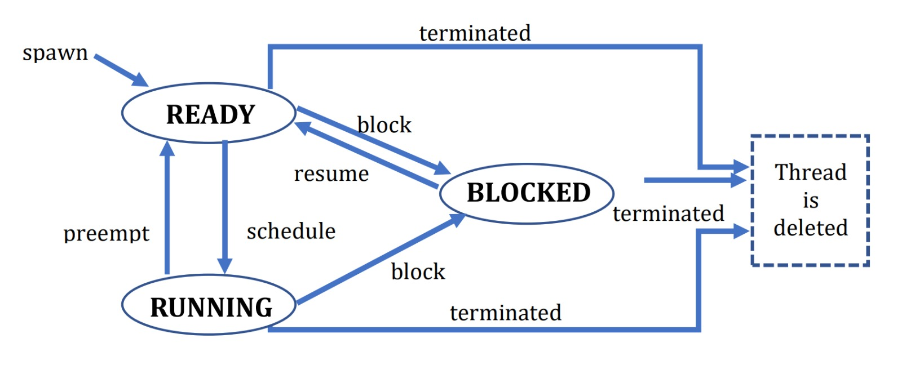
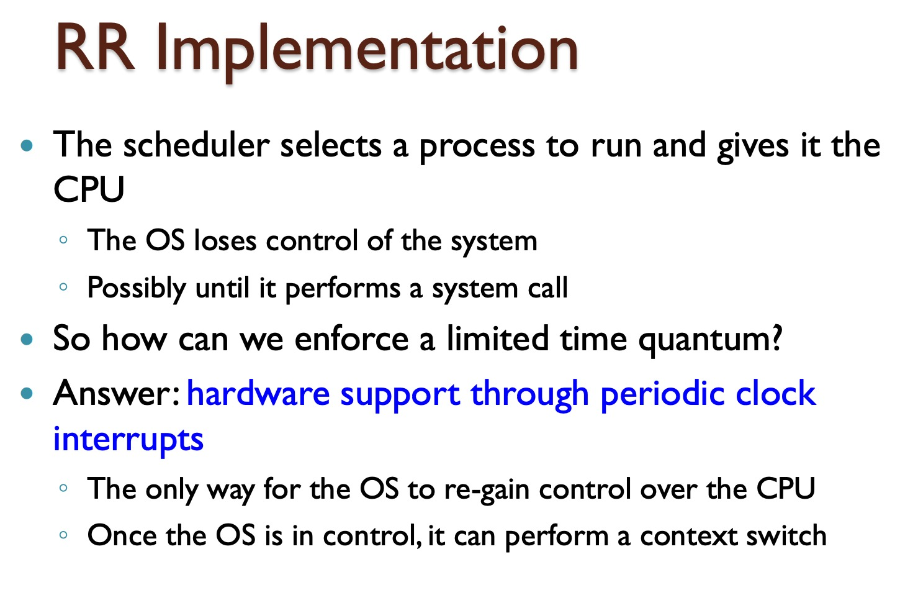
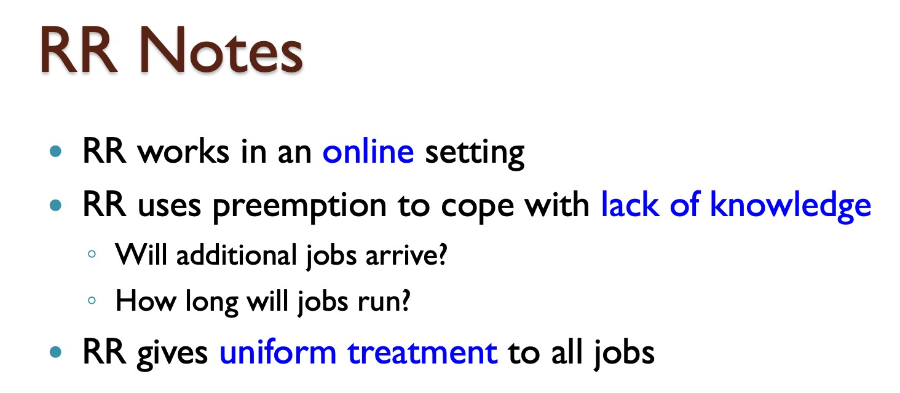
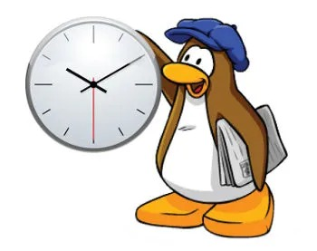

# User-Level Threads Library



## Introduction

This project implements a static library for managing user-level threads. The library provides functionality to create, manage, and schedule user-level threads using the Round-Robin scheduling algorithm. It allows for efficient context switching and customizable thread scheduling.




## File Structure

- `uthreads.cpp`: Implementation of the user-level threads library functions.
- `uthreads.h`: Header file with the public interface of the library.
- `Makefile`: For creating the library, creating a tar file, and cleaning.
- `README`: Project description and build instructions.
- `Resources/`: Directory containing additional resources for the project.

## Library API

### Initialization
```cpp
int uthread_init(int quantum_usecs);
```
Initializes the thread library and sets the main thread (tid = 0) as RUNNING.

### Thread Creation
```cpp
int uthread_spawn(thread_entry_point entry_point);
```
Creates a new thread with the given entry point function.

### Thread Termination
```cpp
int uthread_terminate(int tid);
```
Terminates the thread with the specified tid.

### Thread Blocking
```cpp
int uthread_block(int tid);
```
Blocks the thread with the specified tid.

### Thread Resuming
```cpp
int uthread_resume(int tid);
```
Resumes a blocked thread with the specified tid.

### Thread Sleeping
```cpp
int uthread_sleep(int num_quantums);
```
Blocks the RUNNING thread for the specified number of quantums.

### Getting Thread ID
```cpp
int uthread_get_tid();
```
Returns the thread ID of the calling thread.

### Getting Total Quantums
```cpp
int uthread_get_total_quantums();
```
Returns the total number of quantums since the library was initialized.

### Getting Thread Quantums
```cpp
int uthread_get_quantums(int tid);
```
Returns the number of quantums the thread with the specified tid was in RUNNING state.

## Build Instructions

To build the library, use the provided `Makefile`:
```sh
make
```

This will generate a static library file named `libuthreads.a`.

## Project Requirements

- The library should a maximum of `MAX_THREAD_NUM` threads, including the main thread.
- The main thread (tid = 0) uses the same stack, PC, and registers that were used when `uthread_init` is called.
- The library handle possible signal races by blocking and unblocking signals at the right places.


